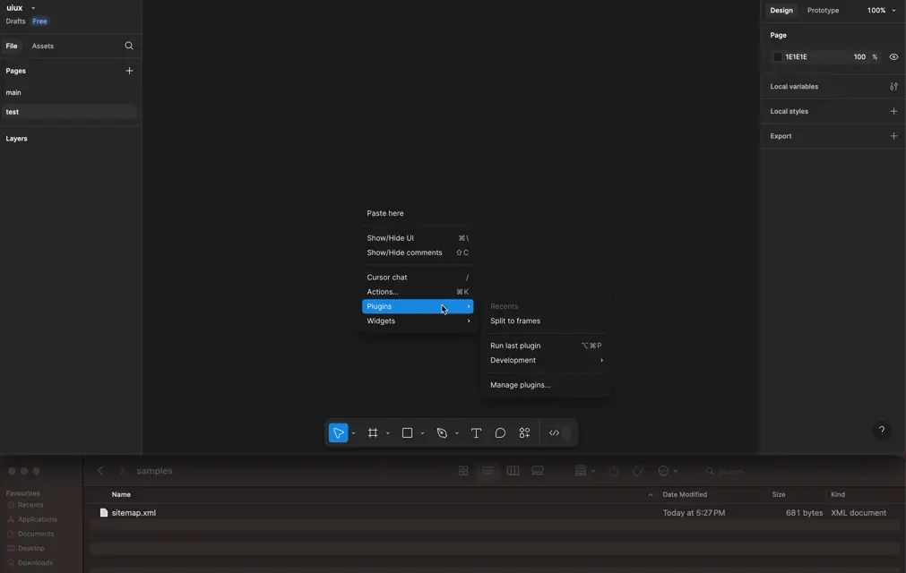
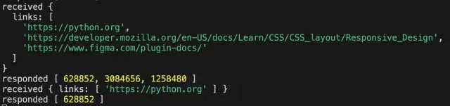

# freezer
provide a snapshots of your domain sites into figma design for site analysis




## prerequisite
1. [node LTS v23.3.0](https://nodejs.org/en)
2. [bun](https://bun.sh/docs/installation)

## installation
### 1. figma plugin app
```sh
# navigate to root directory run
bun install
```
### 2. snapshot service server
```sh
# navigate to server directory run
bun install
```
### 3. headless chrome
```sh
# install your headless chrome to your local environment
npx puppeteer browsers install chrome
```

## run
### 1. figma plugins app
> for development - plugin's ui only
```sh
# navigate to root directory run
bun run dev
```

> for production
```sh
# navigate to root directory run
bun run build
```
import the figma plugin by pointing to the manifest.json in the root directory

[launch figma plugin](https://www.figma.com/plugin-docs/plugin-quickstart-guide/)

### 2. snapshot service server
```sh
# navigate to server directory run
bun run server
```

## run samples xml
A sample xml is provided located on the root directory called samples folder.

## future improvements or features
1. width adjustable snapshots
2. serverless solution or container environment for snapshot service server
3. organised naming image objects in figma
4. organised grouping image per link in figma
5. optimise image split processing
6. option for chrome launch pathing

## contributors
dendrovis team